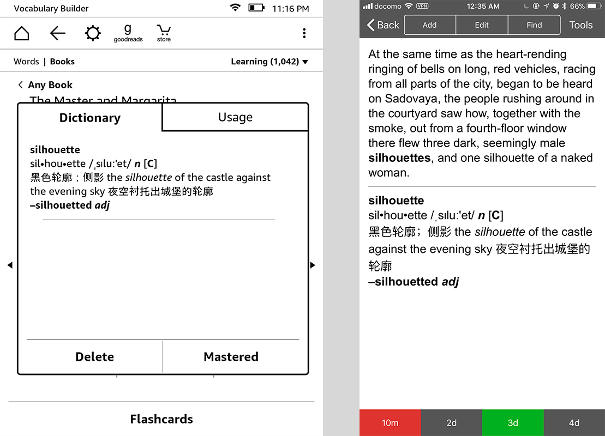

# Export Kindle Vocabulary Builder to Anki APKG



[Vocabulary Builder](https://www.amazon.com/gp/help/customer/display.html?nodeId=201733850) is one of my favorite features on Kindle. With a tap on the word, it pops up a window displaying definitions and at the same time creates a flashcard in the background. What's more, it saves the sentences where the word appreares, which makes it easier to remember words. However, E-Ink is not ideal for frequent paging, and it seems that Vocabulary Builder doesn't have an algorithm on tracking forgeting curve.

This script helps to export Vocabulary Builder word list into an Anki apkg file.

```shell
npm install
node Kindle2Anki.js --vocab vocab.db --dict dict.rawml
```

1.  Find `vocab.db` located in `/[Kindle Volumn]/system/vocabulary/vocab.db`
2.  Find the dictionary file in Kindle, for example `/[Kindle Volumn]/documents/现代汉英词典_B00771V9HS.azw`
3.  Use [libmobi](https://github.com/bfabiszewski/libmobi) to export dictionary into a `rawml` format file (usually the dictionary file has DRM by Amazon, and keep in mind that libmobi and DeDRM is only for personal usages under such condition)
4.  Run the command above.
